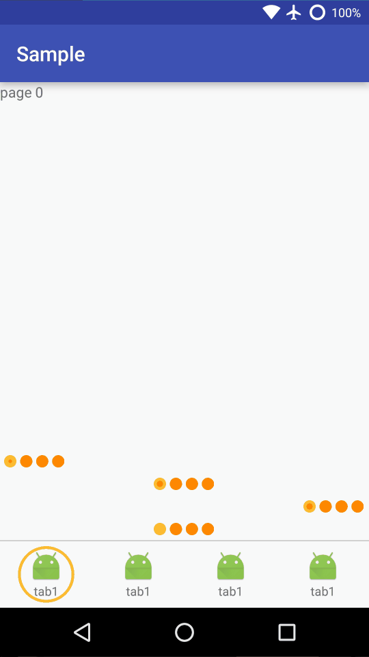

## CircleIndicator
==========
Indicator for ViewPager

layout
```xml
<cn.modificator.circleindicator.CircleIndicator
    android:layout_width="match_parent"
    android:layout_height="65dp"
    app:pointBgColor="color"
    app:pointGravity="left|right|center|fill"
    app:ringColor="color"
    app:ringWidth="fraction:0%-100%" />

<!-- like this -->
<cn.modificator.circleindicator.CircleIndicator
    android:layout_width="match_parent"
    android:layout_height="12dp"
    android:layout_gravity="center_horizontal"
    app:pointBgColor="@android:color/holo_orange_dark"
    app:pointGravity="right"
    app:ringColor="@android:color/holo_orange_light"
    app:ringWidth="50%" />
```
Java
```java
//after viewpager setAdapter
CircleIndicator.setViewPager()
```

##### Enjoy it!
